## raft-kv-http-server

### Architecture




### Fault tolerance

To test cluster recovery, first start a cluster and write a value "foo":

```sh
goreman start
curl -L http://127.0.0.1:12380/my-key -XPUT -d foo
```

Next, remove a node and replace the value with "bar" to check cluster availability:

```sh
goreman run stop raftexample2
curl -L http://127.0.0.1:12380/my-key -XPUT -d bar
curl -L http://127.0.0.1:32380/my-key
```

Finally, bring the node back up and verify it recovers with the updated value "bar":

```sh
goreman run start raftexample2
curl -L http://127.0.0.1:22380/my-key
```

### Dynamic cluster reconfiguration

Nodes can be added to or removed from a running cluster using requests to the REST API.

For example, suppose we have a 3-node cluster that was started with the commands:

```sh
./raft-kv-http-server --id 1 --cluster http://127.0.0.1:12379,http://127.0.0.1:22379,http://127.0.0.1:32379 --port 12380
./raft-kv-http-server --id 2 --cluster http://127.0.0.1:12379,http://127.0.0.1:22379,http://127.0.0.1:32379 --port 22380
./raft-kv-http-server --id 3 --cluster http://127.0.0.1:12379,http://127.0.0.1:22379,http://127.0.0.1:32379 --port 32380
```

A fourth node with ID 4 can be added by issuing a POST:

```sh
curl -L http://127.0.0.1:12380/4 -XPOST -d http://127.0.0.1:42379
```

Then the new node can be started as the others were, using the --join option:

```sh
./raft-kv-http-server --id 4 --cluster http://127.0.0.1:12379,http://127.0.0.1:22379,http://127.0.0.1:32379,http://127.0.0.1:42379 --port 42380 --join
```

The new node should join the cluster and be able to service key/value requests.

We can remove a node using a DELETE request:

```sh
curl -L http://127.0.0.1:12380/3 -XDELETE
```

Node 3 should shut itself down once the cluster has processed this request.